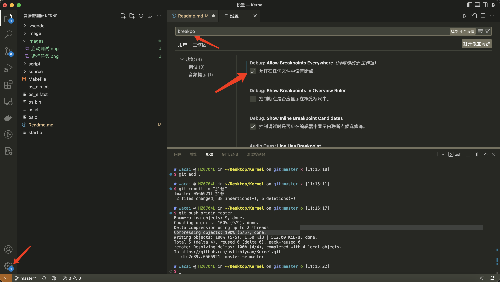

# 实现一个简单的操作系统

## 1. 搭建实验环境

### 工具安装

```
// Mac下安装
$ brew install x86_64-elf-gcc
$ brew install x86_64-elf-gdb
$ brew install cmake
brew install qemu


// Liunx下安装
$ sudo apt-get install gcc-i686-linux-gnu
$ sudo apt-get install gdb
$ sudo apt-get install cmake
$ sudo apt-get install qemu-system-x86
```

### 安装vscode插件

```
C/C++ Extension Pack  // C/C++扩展包
C/C++ // 必备
x86 and x86_64 Assembly // x86汇编语言支持
LinkerScript //提供链接脚本的语法高亮
Hex Editor // 十六进制编辑器
Makefile Tools // make文件工具
```

### 设置vscode任何文件都可以打断点



## 2. 项目运行

```
原始文件

--- scripts // 代码启动调试脚本文件
	--- qemu-debug-liunx.sh liunx下的qemu启动脚本文件
	--- qemu-debug-osx.sh Mac下的qemu启动脚本文件
	--- qemu-debug-win.bat window下的qemu启动脚本文件
--- source  // 我们的代码
	--- start.S 启动第一扇区的代码
	--- os.c 剩余其他扇区的代码
	--- os.h 头文件
--- Makefile  // 编译文件
--- image  // 镜像文件
	--- disk.img 
```

### makeFile文件分析

```c
all: source/os.c source/os.h source/start.S
	$(TOOL_PREFIX)gcc $(CFLAGS) source/start.S // 编译start.S汇编文件，生成start.o文件
	$(TOOL_PREFIX)gcc $(CFLAGS) source/os.c	 // 编译os.cC语言文件,生成os.o文件
	$(TOOL_PREFIX)ld -m elf_i386 -Ttext=0x7c00 start.o os.o -o os.elf // 将生成的.o文件进行链接,生成os.elf文件,并指定生成的代码段的内存地址是0x7c00，运行的时候会放到0x7c00的内存地址上去
	${TOOL_PREFIX}objcopy -O binary os.elf os.bin // 复制成为os.bin文件
	${TOOL_PREFIX}objdump -x -d -S  os.elf > os_dis.txt	 // 头部文件内容输出
	${TOOL_PREFIX}readelf -a  os.elf > os_elf.txt	 // 头部文件内容输出
	dd if=os.bin of=../image/disk.img conv=notrunc // 将os.bin文件写入到disk.img中去，可理解为start.S中的代码会放入到镜像文件的第一个扇区中

```
 ***目的: 将代码段放置到0x7c00处，qemu会从这个内存的这个地方读取***

### 调试启动步骤

调试模式:
1. 首先 终端 -->  运行任务 : 启动我们的qemu任务

2. 运行 ---> 启动调试 : 启动我们的qemu调试工具


> Mac下稍微麻烦一点,要先启动qemu后再开启调试

全速飞奔模式:

去除scripts中的参数

```
# 适用于mac
# 将 -s  -S 参数去除即可
qemu-system-i386 -m 128M -s -S -drive file=disk.img,index=0,media=disk,format=raw 
```

## 3. 添加引导标志

前置: 1、镜像文件中存放启动代码,第一个扇区 2、代码启动时候从0x7c00处启动

在start.S中，我们使用了 .org 0x1fe的伪指令，通知gcc工具链，将0X55、0XAA这两个值放在相对于生成的二进制文件os.bin开头偏移510个字节的地方。然后os.bin会由dd命令写到磁盘映像文件的最开始处。通过这种方式就实现了在磁盘映像文件的第1个扇区最后两个字节添加引导标志的目的。

## 4. 设置寄存器的初始化值

```c
// 此时代码应该是从0x7c00处开始执行的,$_start代表着内存地址0x7c00
_start: 
	mov $0, %ax				// 设置代码段
	mov %ax, %ds			// 设置数据段
	mov %ax, %es			// 设置数据段
	mov %ax, %ss			// 设置栈段
	mov $_start, %esp		// 设置栈的起始地址

// 这里会将代码段寄存器、数据段寄存器、栈段寄存器设置为0,即便不设置，初始化的值也是0，栈顶是0x7c00往上，栈是从高地址向低地址增长
```
此时，计算机应该还是实模式，实模式下访问的是真实的内存地址,大概的访问范围是0 - 1M , 2的20次方 === 1M ,寻址范围是0x00000 - 0xFFFFF,为啥不是2的16次方呢？主要是最早的8086的寄存器都是16位的，后面内存扩充成1M，16位的寄存器无法访问到全部，就采用了段寄存器 << 4  + 偏移(16)位的组合来形成20位的地址,实现对1MB内存的访问

## 5. 加载自己的剩余部分

```c
read_self_all:
	mov $_start_32, %bx // 读取到的内存地址 0x7E00
	mov $0x2, %cx // ch:磁道号, cl:起始扇区
	mov $0x0240, %ax // ah:0x42读磁盘命令,al=0x40 64个扇区,多读一些,32kb
	mov %0x80, %dx // dh:磁头号 ,dl驱动器号0x80 磁盘1
	int $0x0013 // 调用中断,读取磁盘信息
	jc read_self_all // 读取失败则重复

第一个扇区           第2到64个扇区
   ↓                     ↓
---------- | -----------------------|
  0x7c00   |       0x7E00           |
---------- | -----------------------|		
```
	 
## 6. 开启保护模式,从16位到32位

1. 首先关闭中断

```c
cli // 关中断
```
2. 加载gdt表
```c
lgdt gdt_desc // 加载gdt表
// gdt描述符,由lgdt加载
gdt_desc: .word (256*8) - 1 // 大小
	.long gdt_table // 表的地址
// 表的内容
typedef unsigned char uint8_t;
typedef unsigned short uint16_t;
typedef unsigned int uint32_t;

struct {uint16_t limit_l, base_l, basehl_attr, base_limit;}gdt_table[256] __attribute__((aligned(8))) = {
    // 0x00cf9a000000ffff - 从0地址开始，P存在，DPL=0，Type=非系统段，32位代码段（非一致代码段），界限4G，
    [KERNEL_CODE_SEG / 8] = {0xffff, 0x0000, 0x9a00, 0x00cf},
    // 0x00cf93000000ffff - 从0地址开始，P存在，DPL=0，Type=非系统段，数据段，界限4G，可读写
    [KERNEL_DATA_SEG/ 8] = {0xffff, 0x0000, 0x9200, 0x00cf},
};

0 置空的表项
1 内核代码段  0 - 4G
2 内核数据段  0 - 4G
```

3. 设置PE位，进入保护模式

```c
mov $1,%eax
lmsw %ax // 设置PE位,进入保护模式
```

4. 进入32位指令下执行

```c

// 此时，我们已经设置好了代码段寄存器的值,就可以直接用jmp跳转过去执行了
jmp $KERNEL_CODE_SEG, $_start_32 // 段选择子，偏移量 0x7E00
// 32位保护模式,位于512字节后
	.code32
	.text
// 此时已经设置好了内核代码区和数据区的内存寻址范围,将覆盖原来的数据段、代码段寄存器的值	
_start_32:
	mov $KERNEL_DATA_SEG, %ax // 将数据段寄存器设置为16,偏移量0x0000
	mov %ax, %ds
	mov %ax, %es
	mov %ax, %ss
	mov $_start, %esp
	jmp .
```

## 7. 进入分页模式

回顾: 
1. 代码段寄存器1 ---> gdt表 1 : 0x7E00 (_start_32的代码位置), 内存寻址空间从0x00000000 - 0xFFFFFFFF
2. 数据段寄存器2 ---> gdt表 2 : 0x0000 (空),内存寻址空间是从0x00000000 - 0xFFFFFFFF


分页的映射原理： 建立二级页表，然后将虚拟地址(线性地址，程序使用的地址)化分为3部分，高10位用于索引页目录表，中间10位用于索引第二级的页表，从中找到对应的物理页，然后再使用低12位访问页中的偏移

下面，我们要建立2个映射。第一个为页大小为4MB的映射，从虚拟地址0-4MB映射到物理地址0-4M，以便我们的程序仍然存在于它应该存在的地址，不至于程序跑飞。第二个为虚拟地址0x80000000到map_pyh_buffer的映射


1. 设置页目录PDE

```c
// 跳转到C语言中运行
call os_init

#define PDE_P			(1 << 0) // 存在位
#define PDE_W			(1 << 1) // 读写位
#define PDE_U			(1 << 2) // 权限位
#define PDE_PS			(1 << 7) // 声明4M对齐
// 设置目录表 4kb对齐
uint32_t pg_dir[1024] __attribute__((aligned(4096))) = {
    [0] = (0) | PDE_P | PDE_PS | PDE_W | PDE_U,	  // 开始位置0 - 4MB 映射到物理内存 0 - 4MB
};
// 这样，页目录表中第0项就存放着0-4MB的物理映射
```

2. 设置cr3寄存器

```c
mov $pg_dir, %eax // 将页目录的地址给到cr3寄存器
mov %eax, %cr3
```

3. 设置cr0寄存器

```c
mov %cr0, %eax
orl $(1 << 31), %eax // 将cr0的最高位设置为1,打开分页机制
mov %eax, %cr0
```

4. 设置cr4寄存器

```c
mov %cr4,%eax
orl $(1 << 4), %eax  // 允许使用4M到4M之间的映射
mov %eax, %cr4
```

5. 将0x80000000的虚拟地址映射到map_pyh_buffer

```c
// 定义一个数组
uint8_t map_phy_buffer[4096] __attribute__((aligned(4096)));

// 定义一下二级页表
static uint32_t pg_table[1024] __attribute__((aligned(4096))) = {PDE_U};    // 要给个值，否则其实始化值不确定

//  完成映射关系
void os_init (void) {
	// 0x80000000地址的高10位作为索引（左移22位）,它的值是二级页表的值
    pg_dir[MAP_ADDR >> 22] = (uint32_t)pg_table | PDE_P | PDE_W | PDE_U;
	// 0x8000000地址的中间10位作为索引(左移12位 & 0x3FF),它的值就是我要映射的数组的值
    pg_table[(MAP_ADDR >> 12) & 0x3FF] = (uint32_t)map_phy_buffer| PDE_P | PDE_W | PDE_U;
};
// 完成映射后，0x80000000的虚拟地址就对应着map_phy_buffer的物理地址了
```

## 8. 开启定时中断


